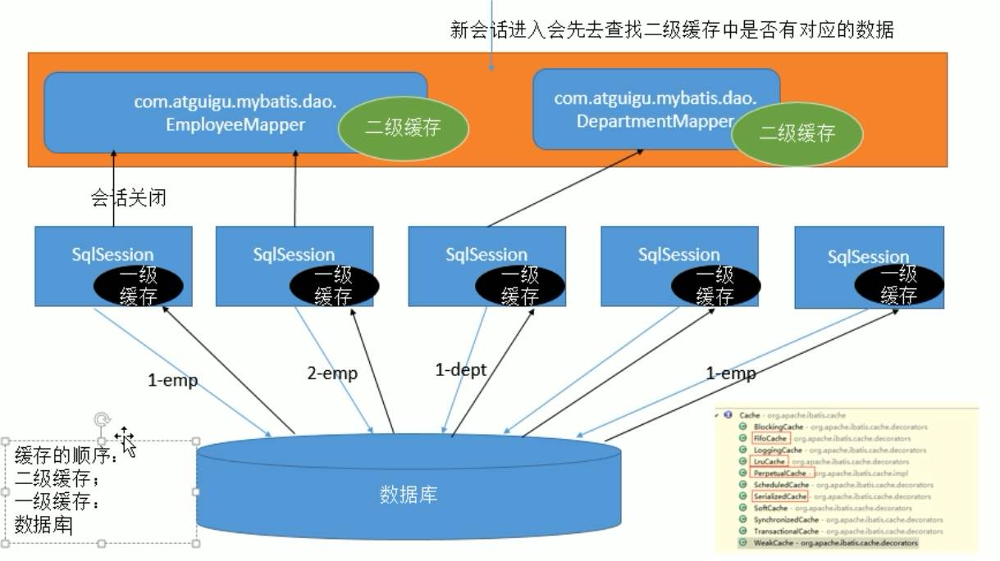

# Mybatis笔记

##### 什么是ORM？
    ORM是对象关系映射，意图通过操作对象来实现对数据的操作
       
##### MyBatis简介
    MyBatis是一款优秀的基于ORM的半自动轻量级持久层框架，它支持定制化SQL、存储过程以及高级映射。
    MyBatis避免了几乎所有的JDBC代码和手动设置参数以及获取结果集。
    MyBatis支持使用XML和注解来配置和映射对象。
 
##### MyBatis的优势
    1. MyBatis是一个半自动化的持久层框架。
    2. 核心SQL可以由开发人员优化
    3. SQL和Java代码相分离，使得功能边界更加清晰
       1. Java代码专注业务
       2. SQL专注数据处理
   
##### MyBatis开发步骤
    1. 添加Mybatis依赖
    2. 创建数据表
    3. 编写数据表对应实体类
    4. 编写数据表与实体类对应的Mapper.xml文件
    5. 编写MyBatis核心配置文件
    6. 编写测试单元

##### 数据库的CRUD
|简写符号|符号全称|SQL语法|SQL含义|
|:-----:|:-----:|:-----:|:-----:|
|  C  | Create | INSERT | 插入 |
|  R  |  Read  | SELECT | 查询 |
|  U  | Update | UPDATE | 更新 |
|  D  | Delete | DELETE | 删除 |

##### Mybatis开发
    1. xml模式开发 -> 参考test/java/MyBatisVersionTest
    2. 注解模式开发 -> 参考test/java/MyBatisDownloadTest
    
##### Mybatis作用域及生命周期
1. SqlSessionFactoryBuilder - 初始化方法中，创建完SqlSessionFactory后，该对象即可丢弃
2. SqlSessionFactory - 作用域在整个类对象或实例对象中，随着类对象或实例对象的销毁而销毁
3. SqlSession - 作用域为调用的方法，方法结束SqlSession对象销毁

##### Mybatis缓存机制
1. ##### 一级缓存
    ##### 特点：
    1. 一级缓存是SqlSession级别的缓存
    2. 不同SqlSession的一级缓存是互不影响的
    3. 一级缓存的底层是个HashMap
    4. 一级缓存默认开启
   
    ##### 执行流程：
    1. 查询一级缓存
       1. 有值：直接返回查询结果
       2. 无值：查询数据库，将结果存入一级缓存，同时返回结果
    2. 增删改一级缓存
       1. 有值：删除一级缓存，然后更新数据库
       2. 无值：直接更新数据库
          
2. ##### 二级缓存
    ##### 特点：
    1. 二级缓存是Mapper或Namespace级别的缓存
    2. 不同的SqlSession共享一个二级缓存
    3. 二级缓存在分布式集群中是不能共享的
    4. 二级缓存默认没有开启
    
    ##### 执行流程：
    1. SqlSession查询二级缓存
       1. 有值：直接返回查询结果
       2. 无值：查询数据库，然后将结果存入二级缓存
    2. SqlSession增删改二级缓存
       1. 有值：清空二级缓存，然后更新数据库
       2. 无值：直接更新数据库
       

##### MyBatis插件介绍
    对Mybatis来说插件就是一个拦截器，用来增强核心对象的功能。
    增强功能的本质是借助于动态代理来对功能增强。
    Mybatis中四大对象都是拦截器：Executor、StatementHandler、ParameterHandler、ResultSetHandler
    
   1. ##### MyBatis插件原理与执行流程 
      1. 每个创建出来的对象不是直接返回的，而是在InterceptorChain.pluginAll(ParameterHandler)中进行处理后返回的
      2. 获取到所有的Interceptor（拦截器，插件需要实现的接口），调用interceptor.plugin(target)，返回target包装后的对象
      3. 插件机制，可用使用插件为目标对象创建一个代理对象。利用插件可以为四大对象创建出代理对象，代理对象可以拦截四大对象中的所有方法。
      
1. ##### Executor - 执行器，负责处理增删改查事务等方法
   1. update
   2. query
   3. commit 
   4. rollback
   
2. ##### StatementHandler - SQL语法构建器，负责Sql的预编译 
   1. prepare
   2. parameterize
   3. batch
   4. update
   5. query
    
3. ##### ParameterHandler - 参数处理器，负责设置参数
   1. getParameterObject
   2. setParameters
   
4. ##### ResultSetHandler - 结果集处理器，负责处理返回结果集
   1. handleResultSets
   2. handleOutputParameters
   
5. ##### Mybatis插件使用
   1. PageHelper - 分页插件使用，该demo在MyBatisVersionTest下
   2. MapperHelper - 通用Mapper插件使用，该demo在MyBatisDownloadTest下
   
##### Mybatis主要构件及相互关系
   1. SqlSession - Mybatis工作时的主要顶层API。表示和数据库交互的回话，完成必要数据库增删改查功能。 
   2. Executor - Mybatis执行器。Executor是Mybatis调度的核心，负责SQL语句的生成和查询缓存的维护
   3. StatementHandler - 封装了JDBC Statement操作，负责对JDBC Statement的操作，例如：参数设置、将Statement结果集转换为List集合
   4. ParameterHandler - 参数处理器，负责将传递的参数转换为JDBC Statement所需要的参数。
   5. ResultSetHandler - 结果集处理器，负责将JDBC返回的ResultSet结果集对象转换成List类型的集合。
   6. TypeHandler - 类型处理器，负责转换Java数据类型和JDBC数据类型
   7. MappedStatement - 维护了select、update、insert、delete节点的封装
   8. SqlSource - 负责根据用户传递的参数动态生成Sql，并将信息封装到BoundSql对象中
   9. BoundSql - 表示动态生成的Sql语句以及相应的参数信息
   
##### Mybatis总体流程
   1. 加载配置文件并初始化
      + 触发条件：加载配置文件
      + 配置来源：
         1. mapper.xml配置文件
         2. Mapper接口的注解对象
   2. 接受调用请求
      + 触发条件：调用Mybatis提供的API
      + 传入参数：statementId和SQL语句的参数
      + 处理过程：将请求传递给下层的请求处理层进行处理
   3. 处理操作请求
      + 触发条件：API接口层传递请求过来
      + 传入参数：statementId和SQL语句的参数
      + 处理过程：
         1. 根据statementId查找到对应的MappedStatement对象
         2. 根据传入的参数对象解析MappedStatement对象，得到最终要执行的SQL和执行传入参数
         3. 获取数据库连接，根据得到的最终SQL语句和执行传入参数到数据库执行，并得到执行结果
         4. 根据MappedStatement对象中的结果映射配置对得到的执行结果进行转换处理，并得到最终的处理结果
         5. 释放连接资源
   4. 返回处理结果
